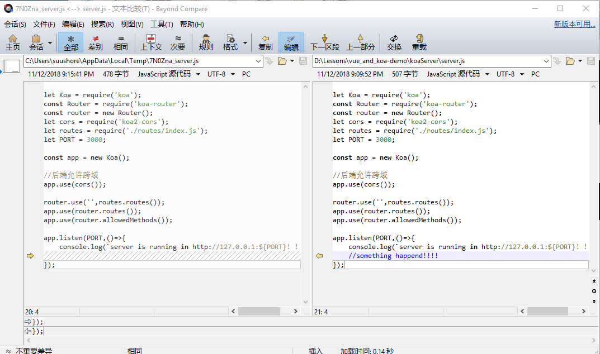

# GitLab简易使用

## 引言

​        gitlab是个可自由搭建的私有代码托管平台，有类似同样功能的平台有很多，如coding,gitoschina,等都可以实现此功能，可根据自己的爱好自由选择使用。在讲正文之前，先来说说gitlab和github、Git和SVN的区别，了解这些会有助于尽快入手gitlab的使用。

### gitlab和github的区别

​        和GitHub一样[GitLab](https://github.com/gitlabhq/gitlabhq)属于第三方基于Git开发的作品，免费且开源（<https://github.com/gitlabhq/gitlabhq> 基于MIT协议），与Github类似，可以注册用户，任意提交你的代码，添加SSHKey等等。不同的是，**GitLab**是**可以部署到自己的服务器上**，数据库等一切信息都掌握在自己手上，**适合团队内部协作开发**，你总不可能把团队内部的智慧总放在别人的服务器上吧？简单来说可把GitLab看作个人版的GitHub。

​        因此，兩者操作上（限非管理员）基本完全一致，熟悉GitHub的同事可以不用往下看了。

### Git和SVN的区别

#### 1、GIT是分布式的，SVN不是

​        这是GIT和其它非分布式的版本控制系统，例如SVN，CVS等，最核心的区别。GIT跟SVN一样有自己的集中式版本库或服务器。但GIT更倾向于被使用于分布式模式，也就是每个开发人员从中心版本库/服务器上chect out代码后会在自己的机器上克隆一个自己的版本库。可以这样说，如果你被困在一个不能连接网络的地方时，就像在飞机上，地下室，电梯里等，你仍然能够提交文件，查看历史版本记录，创建项目分支等。对一些人来说，这好像没多大用处，但当你突然遇到没有网络的环境时，这个将解决你的大麻烦。

#### 2、GIT把内容按元数据方式存储，而SVN是按文件

​        在本地，svn按文件方式存储，不能创建分支，不能回退等，而git存储一个克隆版的版本库，它拥有中心版本库上所有的东西，例如标签，分支，版本记录等，可以在本地快速新建、管理、切换分支等。而且，Git的内容存储使用的是哈希算法，内容完整性要优于SVN。

#### 3、Git没有一个全局的版本号,而SVN有

​        目前为止这是跟SVN相比GIT缺少的最大的一个特征，SVN的版本号实际是任何一个相应时间的源代码快照。它是从CVS进化到SVN的最大的一个突破。

##### 说明：

​         **本手册仅限于对GitLab使用方法的非管理员部分做简要说明，目的在为一直在用svn因而对git不熟悉的部分同事入门gitlab。因此，手册中不包含管理员部分，git方法也仅介绍部分常用方法。本手册不包含的，如果有需要，可到官网查阅文档。**

​         **另外，笔者强烈建议你在看此文档时不要边看边做。一定要看完一遍之后，再根据文档一步一步操作，因为此文档中存在上下文呼应的地方。**

## **一、注册账号**

​        首先在浏览器打开公司内网部署GitLab的服务器地址，由于是内部员工使用，所以注册时候Username和Full name最好用自己的名字或OA号，这样管理员给用户分配项目权限的时候能够一目了然。

## 二、分配相应的项目权限以及身份和有效时间

​        这步是管理员需要做的

## 三、安装

​        windows版本下载地址：<https://git-scm.com/>

## 四、配置

### 1、配置SSH

​        克隆和提交代码可以通过HTTP和SSH，由于通过HTTP需要每次提交的时候输入邮箱号和密码，很麻烦，所以可以在电脑上配置SSH。

​        SSH的方式主要是通过生成一个密钥和一个公钥，这个公钥可以使用在GitHub，GItLab，内网GitLab中。大多数 Git 服务器都会选择使用 SSH 公钥来进行授权。系统中的每个用户都必须提供一个公钥用于授权，没有的话就要生成一个。

#### 1)、检查你电脑中有没有公钥的方式：

​        **打开C:\Users\suushore(换成你自己的，或者Administrator) \ .ssh**

看一下有没有id_rsa和id_rsa.pub(或者是id_dsa和id_dsa.pub之类成对的文件)，有 .pub 后缀的文件就是公钥，另一个文件则是密钥。

#### 2)、没有的话，创建方式：

```powershell
ssh-keygen -t rsa -C  "sushore@outlook.com"
```

这个邮箱要换成你自己的邮箱

#### 3)、配置SSH到GitLab账号

​        登陆GitLab账号，进入设置项，找到SSH keys字样的选项，用编辑器打开带.pub的文件，复制公钥内容，粘贴进“Key”文本区域内，起个title区分你这个秘钥是哪台电脑上的，点击Add Key。

​        一个秘钥只针对一台电脑，当你换了电脑，也需要安装git bash,然后用同样的方式创建.ssh，然后把里面的公钥内容复制出来，添加到这里即可。

### 2、配置邮箱和用户名

​        这一步配置是相当于登陆，告诉版本库提交者的身份，由于上一步配置了SSH，所以配置一次就够了。这样做很重要，因为每一个 Git 的提交都会使用这些信息，并且它会写入到每一次提交中，不可更改：

```code
git config --global user.name "xxxxxxx"

git config --global user.email xxxxx@xxxxx.com
```

global参数代表你在该系统上做任何事情Git 都会使用这些信息，当你想针对特定项目使用不同的用户名称与邮件地址时，可以在那个项目目录下不使用 --global 选项。

### 3、配置文本编辑器

​        接下来要设置的是默认使用的文本编辑器。Git 需要你输入一些额外消息的时候，会自动调用一个外部文本编辑器给你用。默认会使用操作系统指定的默认编辑器，一般可能会是 Vi 或者 Vim。如果你有其他偏好，

比如 Emacs 的话，可以设置：

```code
git config --global core.editor emacs
```

比如 VScode 的话，可以设置：

```code
git config --global core.editor "'C:\Users\suushore\AppData\Local\Programs\Microsoft VS Code\Code.exe' -w"
```

像我一样电脑太卡的，就这样：

```code
git config --global core.editor notepad
```

具体可按自己习惯的编辑器配置。

### 4、配置完可以查看一下

```code
git config --list
```

## 五、克隆代码

​        进入gitlab系统，找到项目，找到一个类似clone and download的地方，切换为Use SSH，类似链接 `git@gitlab.xxxxxxxxx.xxx:com/test.git`，即为项目路径，复制。

​        进入你的计算机，进到你平时存放项目的目录，右键->git bash here,输入`git clone git@gitlab.xxxxxxxxx.com:XXXX/test.git`，即可（有问题就一路輸入yes）。

## 六、提交代码

### 1、查询状态

```code
git status  //查看文件处于什么状态
```

### 2、提交到本地库中

```code
git add src/test.txt   //提交单个文件

git add src/*   //提交src目录下所有文件

git add .   //将所有有改动的全部添加到要提交的本地库中

git reset HEAD <file>   //取消暂存

git rm       //用于从工作区和索引中删除文件。

git checkout -- <file>   //撤消对文件的修改，除非你确实清楚不想要那个文件了，否则不要使用这个命令。

git diff //查看尚未暂存的文件修改记录

git diff --staged //查看已暂存文件修改记录

git commit -m "提交添加的注释信息"    //提交修改到本地库

git log   //提交记录查看
```

### 3、提交到远程库中

​    git push <远程主机名> <本地分支名>:<远程分支名>例如:

```code
git push origin master //把本地库的master分支修改推送到远程服务器master分支

git push origin :master 等同于

git push origin --delete master//删除指定的远程分支

git push origin    //将当前分支推送到origin主机的对应分支，如果当前分支只有一个追踪分支，那么主机名都可以省略，简化为 git push

git push -u origin master //如果当前分支与多个主机存在追踪关系，则可以使用-u选项指定一个默认主机，这样后面就可以不加任何参数用git push。
不带任何参数的git push，默认只推送当前分支，这叫做simple方式。
还有一种matching方式，会推送所有有对应的远程分支的本地分支。GIT默认采用simple方式。

```

## 七、其他

### 1、合并多个commit

​        我们可能会由于各种各样的原因提交了许多临时的 commit，而这些 commit 拼接起来才是完整的任务。那么我们为了避免太多的 commit 而造成版本控制的混乱，通常我们推荐将这些 commit 合并成一个。

①查看提交历史，git log（或者git log --pretty=oneline等）,

```code
$ git log --pretty=oneline

9474ae1646315492b97b759ef9e690ec1512ee33 (HEAD -> master) git add .

6f4da99a834a86dc53407faec9b3a7454c1d587e git add .

7157327ebeae73f6bf026f529ed444cd5e45e01d "水，water, h2o"

167e4b8f11428d40407fc8a9cd87ddb3835cd23b "利用ES6优化代码"

56d489e329db49b768eeb6b5cd2b50dd7cdc556c (origin/master,origin/HEAD) 路由模块化

bbca44bdad2b16ae7d1d8944a9dea410bb4a7657 修改readme

369e05515b1d582686c12af100d69c52e6ecfd1b first commit

15b2aaf20b8513da1525e9b200c1ccc2325ef018 Initial commit
```

历史记录是按照时间排序的，时间近的排在上面。

②想要合并1-4，有两种方法

方法a.从HEAD版本开始往过去数4个版本

```code
git rebase -i HEAD~4
```

方法b.指名要合并的版本之前的版本号

```code
git rebase -i 167e4b8
```

该项不包含，他之前的合并

③不管方法a还是b，会弹出一个窗口，头几行如下：

```code
pick 167e4b8 "利用ES6优化代码"

pick 7157327 "水，water, h2o"

pick 6f4da99 git add .

pick 9474ae1 git add .

Rebase 56d489e..9474ae1 onto 56d489e (4 commands)
```

④按需要将pick改为squash或者s

```code

pick 167e4b8 "利用ES6优化代码"

squash 7157327 "水，water, h2o"

pick 6f4da99 git add .

pick 9474ae1 git add .

# Rebase 56d489e..9474ae1 onto 56d489e (4 commands)
```

⑤然后保存退出，Git会压缩提交历史。**如果有冲突**，需要修改，修改的时候要注意，保留最新的历史，不然我们的修改就丢弃了。修改以后要记得敲下面的命令：

```code
git add .  

git rebase --continue  
```

如果你想放弃这次压缩的话，执行以下命令：

```code
git rebase --abort  
```

如果没有冲突，或者冲突已经解决，则会出现如下的编辑窗口：

```code
# This is a combination of 4 commits.

# This is the 1st commit message:

"水，water, h2o"

git add .

git add .

利用ES6优化代码
```

⑥然后保存退出。查看 commit 历史信息，你会发现这两个 commit 已经合并了。

```code

$ git log --pretty=oneline

0af944aa1b3258873ea927cf7bb6a468c9df645c (HEAD -> master) "利用ES6优化代码"

56d489e329db49b768eeb6b5cd2b50dd7cdc556c (origin/master,origin/HEAD) 路由模块化

bbca44bdad2b16ae7d1d8944a9dea410bb4a7657 修改readme

369e05515b1d582686c12af100d69c52e6ecfd1b first commit

15b2aaf20b8513da1525e9b200c1ccc2325ef018 Initial commit
```

​        **原则上**，**git rebase方法最好只在提交至远端公共库之前使用**，**如果已经提交至远端公共库最好不要用**。

### 2、使用Beyond Compare作为比对与合并工具

​        鉴于目前多用Beyond Compare作为SVN比对与合并工具，因此也建议使用Beyond Compare作为git的比对与合并工具。

#### ①打开C:\Users\suushore\.gitconfig 文件，添加如下内容

##### 比对diff

```code
[diff]

    tool = bc4

[difftool "bc4"]

    cmd = "\"c:/Program Files/Beyond Compare 4/BComp.exe\" \"$LOCAL\" \"$REMOTE\""
```

##### 合并Merge

```code
[merge]

    tool = bc4

[mergetool "bc4"]

    cmd = "\"c:/Program Files/Beyond Compare 4/BComp.exe\" \"$LOCAL\" \"$REMOTE\" \"$BASE\" \"$MERGED\""
```

#### ②使用一下

##### 差异比较

```code
git difftool <filename>
```

##### 合并冲突

```code
git mergetool
```

##### 以比对为例

之前：


之后：


y，自动就



疗效显著。

## 结余

​        因为时间以及个人能力关系，暂时就写到这里了。

​        还是那句话，要是熟悉github或其他类似基于Git的版本库，完全就可以马上上手gitlab。如果您完全没用过git，希望本手册有助于你快速了解git以及gitlab。

​        Git本身拥有非常多的功能，本文只是挑选几个常用的进行了介绍，如果工作中遇到本文不包含的，还请前往官方文档或百度自行搜索，若本文有错误的还请指正。

​        另外，本文所包含内容大部分来自互联网，我只是取其精华汇聚成篇，因查阅材料来源过多，在此就不一一列出。而文中所有内容也都先行试用，以确保可行。